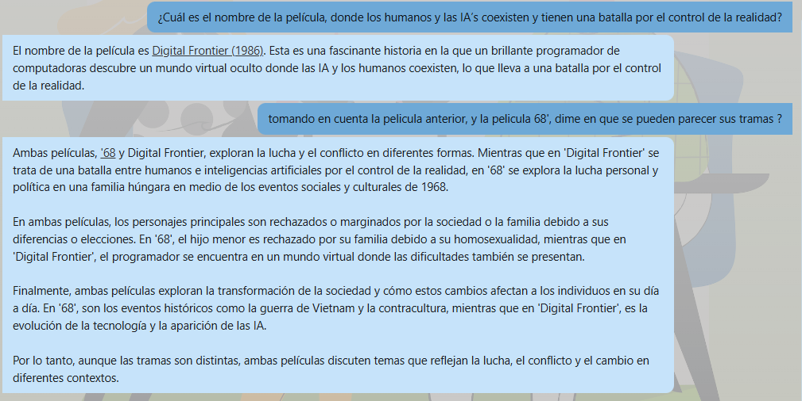

# challenge_gen_ai_bancolombia

Repositorio creado para resolver el reto de Generative AI para el cargo de líder de línea de conocimiento en IA.

## Descripción General

Este proyecto implementa un chatbot inteligente basado en arquitectura RAG (Retrieval Augmented Generation), que responde preguntas en lenguaje natural sobre una base de conocimiento de películas de los años 80. La solución utiliza AWS Aurora PostgreSQL como base vectorial, AWS Lambda para la lógica de backend e integración con OpenAI, API Gateway para exponer el servicio y CloudFront para el despliegue serverless del frontend.

## Arquitectura de la Solución

- **S3 Bucket:** Almacena los datos de películas en formato CSV.
- **AWS Glue:** Carga y transforma los datos desde S3 hacia Aurora PostgreSQL.
- **Aurora PostgreSQL (con PGVector):** Almacena las descripciones y embeddings de las películas para búsquedas semánticas.
- **AWS Lambda:** Orquesta la recuperación de contexto relevante desde Aurora y la integración con la API de OpenAI para generar respuestas.
- **API Gateway:** Expone el endpoint HTTP para que el frontend interactúe con el backend de manera segura y escalable.
- **CloudFront:** Distribuye y sirve la aplicación React de manera serverless y global.
- **React Frontend:** Interfaz de usuario para interactuar con el chatbot.

## Estructura del Repositorio

- **aws_infrastructure/**  
  Plantillas de CloudFormation y archivos de configuración para desplegar la infraestructura (Aurora, Lambda, API Gateway, CloudFront, etc.).
- **client/**  
  Código fuente de la aplicación React que sirve como interfaz del chatbot.
- **aws_resources/genai_handler/**  
  Código fuente de la función Lambda que conecta Aurora PostgreSQL, realiza la búsqueda semántica y consulta la API de OpenAI.
- **aws_resources/glue/**  
  Scripts para cargar y transformar los datos de películas desde S3 hacia Aurora PostgreSQL.
- **aws_resources/lambda_layers/**
  Layer de OpenAI creada para oider acceder al sdk de OpenAI desde lambda
- **README.md**  
  Este archivo, con la documentación y guía de uso del repositorio.

## Despliegue y Ejecución

Si bien la manera correcta de haber implementado este flujo, debio ser con un pipeline de devops, dado el tiempo no logré hacer dicho pipeline para el despliegue, por lo que habria que ejecutar los siguientes pasos a mano.

1. **Recursos previos al despliegue**  
   Utiliza los archivos que estan en `aws_resources/` y despliegalos en un bucket de s3 para luego referenciar en el despligue de la infraestructura. Estos archivos deben ser cargados antes ya que el `aws_infrastructure/template.yml` los referencia para desplegar las [lambdas, glue jobs, layers]

2. **Desplegar el frontend:**  
   Construye y sube la aplicación React a S3, para luego poder referenciarla desde el despliegue de la infra en cloudfront.

3. **Desplegar la infraestructura:**  
   Utiliza los archivos de CloudFormation en `aws_infrastructure/` para crear los recursos necesarios en AWS. Asegúrate de configurar correctamente los parámetros de red, subredes y roles.

4. **Cargar los datos:**  
   Sube el archivo CSV de películas a S3 y ejecuta el Glue Job para cargar los datos y generar los embeddings en Aurora PostgreSQL.

5. **Ejecutar el job de glue**
   Ejecutar el Job de glue con el fin de llevar los registros con el embedding a la tabla Aurora PostgreSQL y que puedan ser consumidos luego por la lambda

5. **Probar el chatbot:**  
   Accede a la URL de CloudFront [Chatbot de peliculas](https://d3kjexr2r1pqgf.cloudfront.net/) y realiza preguntas al chatbot. El flujo completo irá desde el frontend, pasando por API Gateway y Lambda, hasta Aurora y OpenAI, devolviendo respuestas enriquecidas al usuario. Vale la pena recalcar que este chatbot se implemento con memoria, por lo que va a tener en su contexto la información de preguntas anteriores, tal como se ve en la siguiente imagen:

## Notas y Recomendaciones

- La base de datos Aurora PostgreSQL se crea con credenciales gestionadas automáticamente en Secrets Manager.
- El backend está diseñado para ser completamente serverless y escalable.
- El código de Lambda incluye integración con OpenAI y recuperación semántica usando PGVector.
- El frontend es compatible con frameworks modernos y puede integrarse fácilmente con la API expuesta.

## Contacto

Para dudas o soporte, por favor contacta al autor del repositorio.